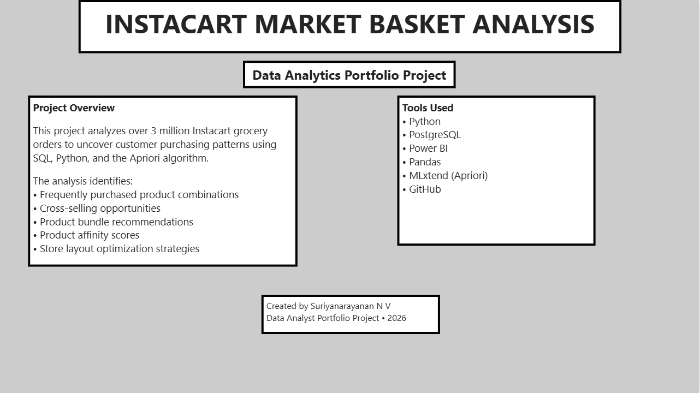
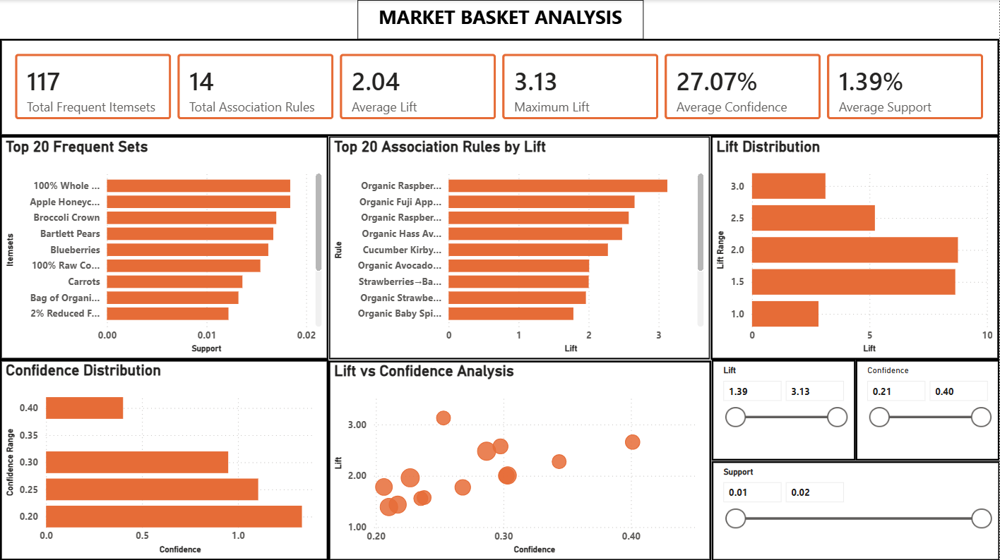
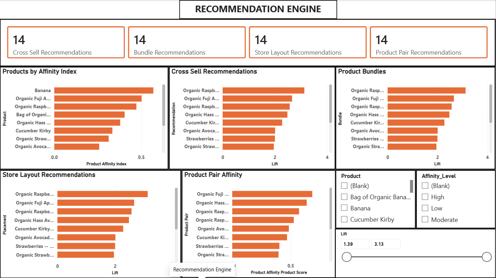
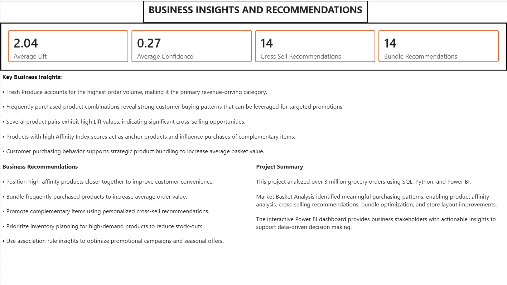

# 🛒 Instacart Market Basket Analysis


---

## 📖 Project Overview

This project performs **Market Basket Analysis** on the Instacart Online Grocery Shopping Dataset to discover customer purchasing patterns and generate actionable business recommendations.

Using **Python**, **PostgreSQL**, and the **Apriori Algorithm**, the project identifies frequently purchased product combinations, association rules, cross-selling opportunities, bundle recommendations, and product affinity scores.

The final insights are presented through an **interactive Power BI dashboard** consisting of multiple business-focused report pages.

---

# 🎯 Business Objectives

- Analyze customer purchasing behavior
- Discover frequently purchased product combinations
- Generate Association Rules using the Apriori Algorithm
- Recommend complementary products
- Identify high-value product bundles
- Calculate Product Affinity Index
- Optimize store layout using purchasing patterns
- Develop an executive Power BI dashboard for decision makers

---

# 🛠️ Technology Stack

| Category | Tools |
|-----------|-------|
| Programming | Python |
| Database | PostgreSQL |
| Data Analysis | Pandas, NumPy |
| Market Basket Analysis | MLxtend (Apriori Algorithm) |
| Data Visualization | Matplotlib |
| Dashboard | Power BI |
| Version Control | Git & GitHub |

---

# 📂 Repository Structure

```text
Instacart-Market-Basket-Analysis/
│
├── data/
│   ├── raw/
│   └── processed/
│
├── docs/
│   ├── screenshots/
│   └── model/
│
├── outputs/
│   ├── csv/
│   └── images/
│
├── powerbi/
│
├── sql/
│
├── src/
│
├── README.md
├── requirements.txt
├── LICENSE
└── .gitignore
```

---

# 🔄 Project Workflow

```
Raw Dataset
      │
      ▼
Data Cleaning (Python)
      │
      ▼
Data Preprocessing
      │
      ▼
SQL Business Analysis
      │
      ▼
Market Basket Analysis
      │
      ▼
Association Rule Mining
      │
      ▼
Recommendation Engine
      │
      ▼
Power BI Dashboard
      │
      ▼
Business Insights & Recommendations
```

---

# 📊 Dashboard Pages

## 🏠 Home



---

## 📈 Executive Overview


---

## 🛒 Market Basket Analytics



---

## 💡 Recommendation Engine



---

## 📊 Business Insights & Recommendations



---

# 📈 Key Features

- End-to-end Data Analytics Pipeline
- Data Cleaning & Preprocessing
- SQL Business Case Analysis
- Market Basket Analysis (Apriori)
- Association Rule Mining
- Product Affinity Analysis
- Cross-Sell Recommendation Engine
- Bundle Recommendation System
- Store Layout Optimization
- Interactive Power BI Dashboard

---

# 📊 Key Business Insights

- Fresh produce contributes significantly to total order volume.
- Strong association rules reveal frequently purchased product combinations.
- High Lift values indicate valuable cross-selling opportunities.
- Product Affinity Index identifies influential products within customer baskets.
- Product bundling can improve average basket value.
- Store layout optimization can increase customer convenience and sales.

---

# 🚀 How to Run

## Clone Repository

```bash
git clone https://github.com/Suriya-21/Instacart-Market-Basket-Analysis.git
```

---

## Install Dependencies

```bash
pip install -r requirements.txt
```

---

## Execute

1. Run the Python scripts inside the `src/` folder.
2. Execute SQL scripts from the `sql/` folder.
3. Review generated outputs in the `outputs/` folder.
4. Open the Power BI dashboard (if available).

---

# 📁 Dataset

**Dataset**

Instacart Online Grocery Shopping Dataset 2017

Download:

https://www.instacart.com/datasets/grocery-shopping-2017

> **Note:** The raw dataset is not included in this repository because of its large size.

---

# 📌 Power BI Dashboard

The original `.pbix` file is approximately **197 MB**, which exceeds GitHub's maximum file size limit (100 MB).

This repository includes:

- Dashboard screenshots
- SQL scripts
- Python source code
- Analytical outputs

---

# 🔮 Future Improvements

- Customer Segmentation
- Sales Forecasting
- Customer Lifetime Value Analysis
- Machine Learning Recommendation System
- Real-Time Dashboard Integration
- Azure / Microsoft Fabric Deployment

---

# 👨‍💻 Author

**Suriya Narayanan**

Aspiring Data Analyst

### Skills

- Python
- SQL
- PostgreSQL
- Power BI
- Data Analysis
- Data Visualization
- Market Basket Analysis

---

## ⭐ If you found this project interesting, consider giving it a star!
